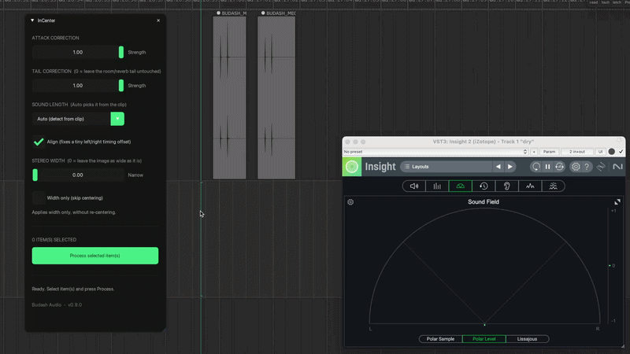

# InCenter

A free tool that re-centers a stereo image that's pulled to one side. It
runs entirely inside your own REAPER session.

*by [Budash Audio](https://budashaudio.com) · v0.10.0 · MIT-licensed*



## Why rotation, not narrowing

The common fixes for an off-axis stereo image (mid/side width reduction,
mono-summing) work by narrowing the stereo base until the offset is
less noticeable. That costs you real width.

InCenter instead measures the actual angle of the offset, per frequency
band, and rotates it back to center. The stereo base keeps whatever
width it had. Only its orientation changes.

## Who it's for

**Portable-recorder captures.** Field recordings off an H1, H4, H5 or
similar handheld, X/Y or A/B, where the recorder wasn't quite square to
the source and the image came back pulled to one side.

**Designed stereo assets.** Whooshes, blips, textures and other
synthesized sound designed without ever watching the stereo base on a
goniometer: the image can drift off-center in the design process just
as easily as from a badly-aimed mic, and needs the same fix.

## A note on file formats

REAPER can play audio in almost any format - mp3, mp4, flac, aiff and
so on - without you ever noticing the difference. InCenter is not
REAPER: it reads WAV only. If an item's source is anything else,
InCenter skips it, with a status line naming the format as the reason.

Watch for this specifically in a REAPER video workflow, where the same
.mp4 sits on both a video track and an audio track. REAPER plays that
.mp4 fine either way, so the limitation isn't obvious until you hit
it: to InCenter, the audio-track copy is still an unsupported .mp4. See
[Video and other non-WAV sources](#video-and-other-non-wav-sources) for
the fix.

## Install

Requires the **ReaImGui** extension (Extensions -> ReaPack -> Browse
packages -> search "ReaImGui"), version 0.8.5 or newer.

A system **Python 3** with `numpy` is optional but recommended: it is
faster and it enables Align. If you'd like it and don't already have
Python set up, follow **[INSTALL_Python.md](INSTALL_Python.md)**, a plain,
step-by-step guide (no Python knowledge needed) for macOS, Windows and
Linux. InCenter auto-detects the interpreter: it actually tries
`import numpy` in each candidate, so it won't pick a Python that's
missing the library. Without one, InCenter runs its built-in engine
instead, see [Running without Python](#running-without-python).

**Via ReaPack** (recommended): Extensions -> ReaPack -> Import
repositories..., paste this URL, then OK:

```
https://raw.githubusercontent.com/budashaudio/InCenter/main/index.xml
```

Then Extensions -> ReaPack -> Synchronize packages, find InCenter under
the Budash Audio category, right-click it, Install, then Apply. ReaPack
then handles updates automatically.

**Manual install**, as a fallback:

1. Download the latest release from the
   [GitHub Releases page](https://github.com/budashaudio/InCenter/releases)
   and copy the whole folder into your REAPER `Scripts` folder (any
   subfolder is fine: each script locates itself and its siblings
   automatically, no fixed path is baked in).
2. In REAPER: Actions -> Show action list -> New action -> Load ReaScript...
   and pick `BudashAudio_InCenter.lua`, inside the `Budash Audio` folder
   (the control panel, and the only file here you load directly).

**Do not load `incenter.py`, `incenter_core.lua` or `incenter_eel.lua` as
REAPER actions.** They're dependencies: `incenter_core.lua` is the
REAPER-side mechanics the panel calls into (process runner, source-swap,
Python finder, engine selection), `incenter.py` is the Python DSP engine,
meant to run only as a subprocess with CLI arguments, and
`incenter_eel.lua` is the built-in fallback engine. Loading `incenter.py` directly runs
it under REAPER's own embedded Python, which can't import numpy and may
hang REAPER. All three carry an `@noindex` tag so ReaPack won't list them as
separate actions.

## Use


Select one or more stereo WAV items, open the InCenter panel, and set:

- **Attack / Tail strength**: how hard to pull each part back to center
  (0-1). Tail 0 leaves the room/reverb tail where it is.
- **Sound length**: leave on **Auto** to let it pick the analysis window
  from the detected sound length, or force a size for unusual material.
- **Align**: on for spaced mics (AB); off for coincident mics (XY/MS),
  which have no timing offset to fix.
- **Stereo width**: optional, narrows the image after centering.
- **Width only (skip centering)**: applies stereo width reduction
  without re-centering, for when you only want the narrowing.

Press **Process selected item(s)**. Each item's take is repointed at a
corrected file named `<name>_centered_<HHMMSS>.wav`, written to the
project's media folder (or next to the source if the project isn't saved).
The original source audio is never overwritten.

## Running without Python

InCenter picks its engine by itself; there is nothing to choose. If it
finds a Python 3 with `numpy`, it uses that, exactly as before. If not, it
falls back to a built-in engine that runs inside REAPER and needs only
ReaImGui 0.8.5 or newer. To tell which one is running, look at the Align
checkbox: if it is greyed out and its label reads "Align (Not available in
the built-in engine. See README)", the built-in engine is active; if you can
tick it, Python is.

The built-in engine is a fallback, not a replacement. Differences from the
Python engine:

- **No Align.** The checkbox is greyed out. Spaced-mic (AB) material with a
  timing offset between the channels can't be corrected for it here.
- **Always writes 32-bit float,** whatever the source's bit depth.
- **Slower:** roughly 4x realtime, about 21 seconds for a 1:20 file,
  against about 4 seconds with Python. The panel freezes while it works,
  as it does with Python.
- **Items at a playback rate other than 1.0 are skipped** with a message
  (the Python engine keeps the rate). Set the rate to 1.0 or glue first.
- Same as with Python: WAV sources only, stereo only, reversed and glued
  (SECTION) takes are skipped with a message, output goes to the same
  place with the same names, and one Undo step covers a whole run.

Results from the two engines are not byte-identical. They implement the
same algorithm, and Align is the only intended difference in what they do.

### Installing Python to get Align and speed

If you'd like Align, faster processing and output at the source's original
bit depth, install Python 3 and the NumPy library once; InCenter finds them
by itself afterwards (restart the panel, no other setup):

1. Install Python 3 from python.org (macOS/Windows) or your package
   manager (Linux).
2. Install NumPy: run `pip3 install numpy` (Windows: `py -m pip install
   numpy`).
3. Close and reopen the InCenter panel. Align is now available.

The full walkthrough for each system, including how to open a terminal, is
in **[INSTALL_Python.md](INSTALL_Python.md)**. If InCenter still uses the
built-in engine, see [Troubleshooting](#troubleshooting).

To use one engine on purpose, set `FORCE_ENGINE` near the top of
`BudashAudio_InCenter.lua` to `"python"` or `"eel"` (the default `nil`
means automatic).

## What it does

- Estimates the stereo angle **per frequency band** (24 log-spaced bands)
  and rotates each band back to center. That fixes the frequency-dependent
  tilt a plain L/R gain trim can't touch.
- Estimates it **separately for the attack and the tail** of each sound
  (onset detection on the energy envelope) and crossfades between the two
  corrections, since a recording's transient and its room tail often
  sit at different angles.
- Optional **inter-channel delay alignment** (GCC-PHAT, sub-sample
  precision) for spaced-mic (AB) recordings, where part of the "wrong"
  image comes from a small timing offset between channels. The delay is
  measured on the loudest part of the region being processed, so leading
  silence doesn't fool it.
- Optional **stereo width reduction**, applied last and independently of
  centering, with RMS-matched output level.
- **Keeps your format and metadata.** Output bit depth and sample rate
  match the input (16->16, 24->24, float->float), and BWF/bext timecode,
  iXML and other chunks are carried across so the corrected file drops
  back onto the timeline exactly where the original sat.

## What InCenter does not do

- It corrects a **static offset of the whole stereo scene**. It measures
  one angle per frequency band across the file and rotates each band back.
- It does **not** separate sources. It cannot tell a footstep from the
  street behind it, and it cannot move one and leave the other.
- On material where sources move across the stereo base, or where the
  scene is already symmetric, the measured offset will be near zero and
  **no correction is applied: this is the correct result**. The status
  line after processing reports the measurement so you can see this for
  yourself.
- A source moving across the image is part of the recording, and
  InCenter leaves it alone.

## Known limitations

- **Metadata:** standard chunks (bext, iXML, cue, LIST, junk) are carried
  over; exotic vendor chunks should survive too, but only the common ones
  are tested.
- **Bit depth:** 16/24/32-bit int and 32/64-bit float are supported. A
  24-bit source that can't be decoded cleanly falls back to 32-bit float
  output.
- **SECTION takes** (reversed or glued items) are skipped with a message.
  Glue to a plain file first if you need to process one.
- **Item region:** processing is scoped to the item's trimmed region: an
  item covering the whole source file behaves as before, and a trimmed
  item is measured and corrected using only its own content.
- **Very short items:** items under about 21ms at 48kHz (1024 samples)
  are refused with a clear error message. Items only marginally longer
  than that floor still collapse to a single measured angle, since there
  aren't enough STFT frames for the attack/tail crossfade to mean
  anything. Normal attack/tail splitting resumes from roughly 22ms at
  48kHz.
- **Windows:** the macOS and Linux paths are the tested ones. Windows
  support is implemented but **experimental**: please report back if you
  run it there.

## Video and other non-WAV sources

An item whose source is .mp4, .mp3, .flac or .aiff is skipped. If you
need InCenter to correct one, render it to WAV first:

1. Select the audio-copy item, not the one carrying your picture.
2. Run **Item: Glue items**. This decodes the source into a new WAV,
   trimmed to the item.
3. Run InCenter on the glued item.

InCenter replaces an item's source with the corrected WAV, so never run
it on the item carrying your video: that item would lose its picture.

## Troubleshooting

- **Nothing happens / REAPER seems frozen:** first check you loaded
  `BudashAudio_InCenter.lua`, **not** `incenter.py` (the most common
  mistake).
- **Align is greyed out ("built-in engine") but you have Python:** InCenter only uses a Python
  that has numpy installed, and auto-detection only checks the usual
  install locations. If yours is missing numpy, see
  [INSTALL_Python.md](INSTALL_Python.md). If it's a pyenv, conda, or other
  custom-prefix install, set `PYTHON_OVERRIDE` near the top of
  `BudashAudio_InCenter.lua` to its full path.
- **"No usable Python 3 found" / "InCenter needs one of these":** you set
  `FORCE_ENGINE = "python"` with no Python available, or neither engine
  can run. Install Python (see [INSTALL_Python.md](INSTALL_Python.md)) or
  update ReaImGui to 0.8.5 or newer.
- **The panel freezes while processing:** this is expected. `ExecProcess`
  blocks the main thread until the worker exits. Batching every selected item
  into one process launch keeps it as short as possible, but it isn't
  instant on long files.

## Why it's built the way it is

A few non-obvious decisions, in case you're reading the source:

- **DSP runs in a subprocess.** REAPER's built-in Python can't safely
  import numpy (it deadlocks via ctypes/libffi inside the embedded
  interpreter), so all processing shells out to your system Python via
  `reaper.ExecProcess` with a small wrapper script that captures the real
  exit code to a sidecar file.
- **One `incenter.py` process handles the whole batch.** `ExecProcess`
  blocks REAPER's UI thread until the worker exits, so N separate process
  launches would mean N back-to-back freezes instead of one - processing
  every unique source in a single `--batch` run keeps that down to one
  blocking call (and lets the panel wrap the whole run in a single Undo
  block). That's expected: the panel shows "Processing..." first so you
  can see it started.
- **Own WAV reader/writer instead of a library one.** scipy.io.wavfile
  (back when scipy was still a dependency) can't write 24-bit and drops
  metadata chunks; parsing the RIFF container directly lets input format
  == output format and preserves bext/iXML/cue/etc.
- **The old take source is never destroyed after a swap.** Destroying a
  `PCM_source` still shared between takes segfaults inside
  `SetActiveTake`. Leaving it alone leaks a little memory per run, which
  is the better trade.
- **Peaks are rebuilt with the 3-phase `PCM_Source_BuildPeaks` protocol**
  after every source swap. Without it the waveform doesn't redraw.
- **REAPER-side mechanics live in `incenter_core.lua`.** The process
  runner, the source-swap, and the Python finder are REAPER plumbing.
  That separation is worth keeping on its own merits, independent of
  how many scripts call into it.

## Running the tests

`tests/test_incenter.py` covers the Python DSP engine (`pytest`);
`tests/lua/incenter_core_spec.lua` and `tests/lua/engine_select_spec.lua`
cover the Lua core (including engine selection) against a fake `reaper`
API (`busted`). The built-in EEL engine's DSP can't run outside REAPER, so
it isn't covered by either suite. These are developer-only checks, separate
from the runtime requirements above.

```
python3 -m pip install pytest
python3 -m pytest tests/

brew install lua luarocks   # macOS; use your platform's package manager
luarocks install busted
eval "$(luarocks path)"
busted
```

## Requirements

- REAPER (developed on the portable macOS build, Apple Silicon)
- ReaImGui 0.8.5 or newer
- Python 3 with `numpy`: optional, recommended for speed and Align
- Stereo WAV sources (24-bit/48 kHz is the primary target; other stereo
  WAVs work too)

## Changelog

- **0.10.0**: Runs without Python. With no Python 3 + numpy found,
  InCenter falls back to a built-in engine (ReaImGui 0.8.5+). It has no
  Align, always writes 32-bit float, is slower (roughly 4x realtime: about
  21 s for a 1:20 file, versus about 4 s with Python) and skips items whose
  playback rate isn't 1.0. With Python nothing changes. Align is greyed out
  with a note on the built-in engine; new `FORCE_ENGINE` setting to pick one
  manually.
- **0.9.0**: First public release. Per-band attack/tail centering,
  GCC-PHAT alignment on the loudest region, auto window selection, and
  item-region processing (a trimmed item is measured and corrected using
  only its own region of the source file, so a long recording with
  several events at different stereo positions - e.g. radio chatter -
  doesn't get averaged into one measurement). A "Width only" checkbox
  applies stereo width reduction without re-centering. Diagnostic
  reporting of what was measured after each run, format- and
  metadata-preserving WAV I/O, output to the project media folder.
  Experimental Windows support.

## Credits & reporting

Built by Budash Audio. Bug reports and feedback are welcome. Please
include your OS, REAPER version, and the text from the panel's status
line if it showed an error.

## License

MIT. See [LICENSE](LICENSE). Copyright (c) 2026 Budash Audio.

Product and company names mentioned may be trademarks of their respective
owners. InCenter is not affiliated with or endorsed by any of them.
